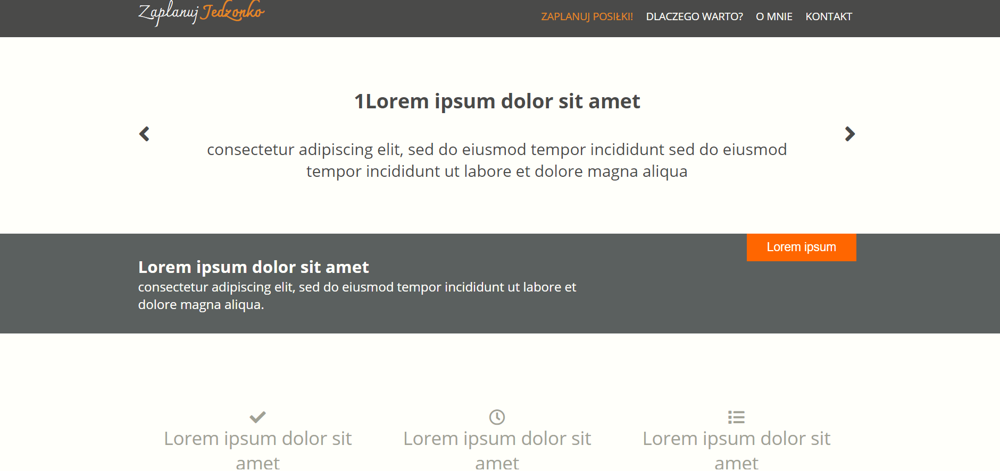
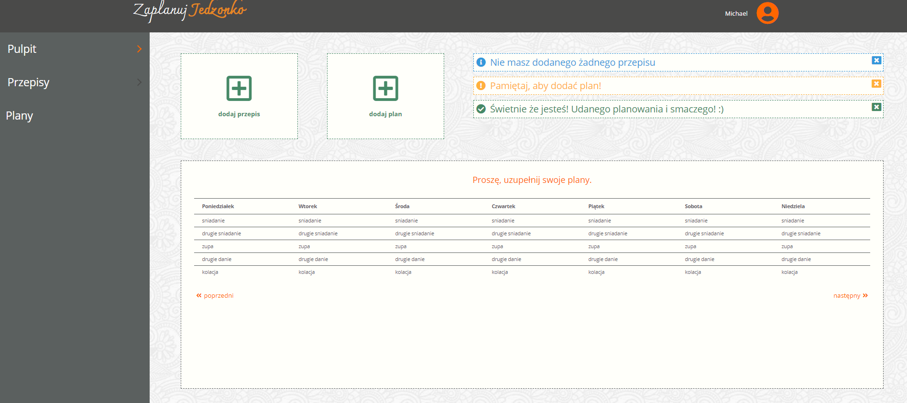
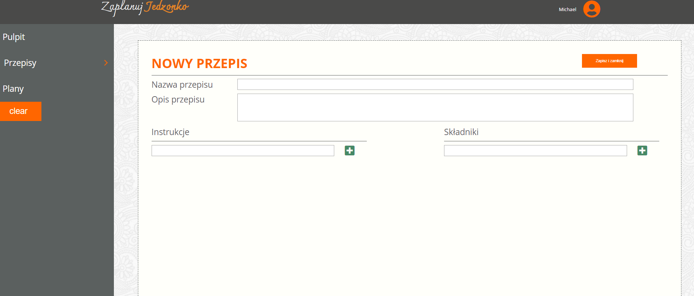

# Info
The first application on our CodersLab course based on SCRUM methodology and JavaScript created by: [Błażej Bałruszewicz](https://github.com/Buashei), [Edyta Pawelska](https://github.com/edyta1pawelska),[Piotr Sitarek](https://github.com/PiotrSitarek).

## Technologies
* HTML5
* CSS 3
* JavaScript
* localStorage

## Available Scripts
You can run it with
`gulp` or `gulp serve`  - runs GULP in `watchmode`. Page will be run on `localhost` it will be refreshed and set css whenever you change any `scss`, `js` or `html` file.

`gulp watch` - runs GULP in supervision mode, it will compile `main.scss` in `css/main.css`

`gulp sass` - Compiling SASS to CSS

## Screenshots

